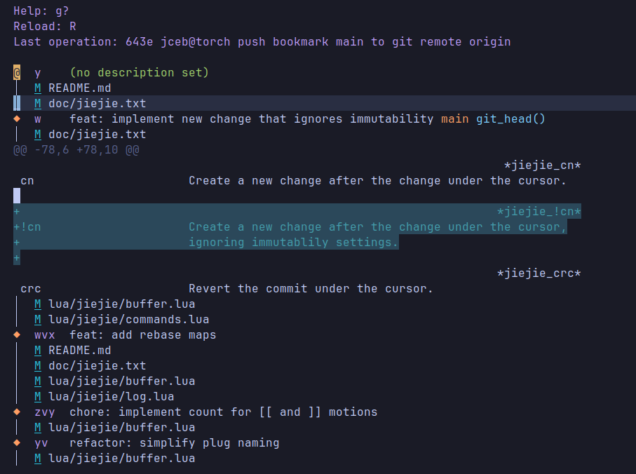

# jiejie

Neovim plugin that adds support for the Jujutsu source control management
system. The design is heavily inspired by
[vim-fugitive](https://github.com/tpope/vim-fugitive).



## Usage

jiejie provides a large amount of key mappings in the log window to expose as
much of jujutsu's functionality as possible. For remembering the mappings more
easily, these rules might prove helpful:

- The current change (`@`) is at the center of all interactions. Rebasing a
  commit, squashing changes, all references the current change.
- When the cursor is on another change, this other change becomes the target of
  the operation, e.g. the current change (`@`) is rebased upon the change under
  the cursor.
- Breaking operations, e.g. moving a bookmark backwards (`--allow-backwards`) or
  modifying an immutable change (`--ignore-immutable`), can be achieved by
  adding a leading `!` to the mapping.
- Destructive operations or operations that prompt the user for an arbitrary
  change id use upper case letters, e.g. `cbM` for moving an arbitrary bookmark
  to the change under the cursor.
- Shortcuts follow jujutsu's aliases where possible, e.g. all bookmark related
  `cb` mappings start with `c` (change) and `b` (bookmark alias).

## Features

- UX very close to [tope's vim-fugitive](https://github.com/tpope/vim-fugitive)
  - Edit file (`<CR>`, `o`, `gO`, `O`)
  - Open revision of a file (`:Jedit [revision]:[file]`, or by selection the
    file in the log summary via `<CR>`, `o`, `gO`, `O`)
  - Open change (`:Jedit [revision]`, `K`)
  - Toggle inline diff (`=`)
  - Edit diff (`:Jdiffsplit [revision]`, `dD`, `dd`, `dV`, `dv`, `dS`, `ds`,
    `dH`, `dh`, `dq`, `d?`)
  - Wraper for `jj` CLI (`:J` or `:Jj`)
- Log buffer (`:J` or `:Jj`)
  - Includes the list of modified files alongside the log
  - Set log to different views (`g1`, `g2`, `g...`)
  - Navigation between changes, files and hunks (`[[`, `]]`, `i`)
  - Increase or decrease the number of log entries shown (`<C-a>`, `<C-x>`)
  - Close buffer (`q`, `gq`)
  - Prepopulate a : command with the file under the cursor (`.`)
- Modify commits from the log buffer
  - Add `!` prefix to mappings for modification of immutable changes
  - Edit change (`<CR>`)
  - Pull and push changes to git (`gu`, `gp`)
  - Modify change description in editor (`ce`) or quick edit the first line
    (`cd`) or copy commit information (`yy`, `yc`, `yC`)
  - Create a new change after the change under the cursor (`cn`)
  - Commit change or file under the cursor (`cc`)
  - Squash change or file into parent or into change under cursor (`cs`, `cS`)
  - Duplicate / cherry-pick change under the cursor (`cpP`, `cpp`, `cpM`, `cpm`,
    `cpT`, `cpt`)
  - Revert change under the cursor (`cR`)
  - Abandon change or file under the cursor (`X`)
  - Rebase change tree or individual change (`rbM`, `rbm`, `rbO`, `rbo`,`rO`,
    `ro`, `rR`, `rr`)
  - Undo last operation (`cU`)
  - Bookmark management (`cbb`, `cbc`, `cbF`, `cbf`, `cbM`, `cbm`, `cbR`, `cbr`,
    `cbX`, `cbx`)
  - Tag management (`ctc`, `ctm`, `ctt`, `ctX`, `ctx`)

## Installation

With Lazy, add this configuration to nvim:

```lua
{
  -- https://github.com/jceb/jiejie.nvim.git
  "jceb/jiejie.nvim",
}
```

## Roadmap

See [ROADMAP.md](./ROADMAP.md).

## References

There isn't too much information about Jujutus on the web, yet. Here are a
number of references that I find helpful:

- [Jujutsu documentation](https://docs.jj-vcs.dev/latest/)
- [Jujutsu's Wiki - Neovim integration](https://github.com/jj-vcs/jj/wiki/Vim,-Neovim)
- [Jujutsu Tutorial by Steve Klabnik](https://steveklabnik.github.io/jujutsu-tutorial/)
- Jujutsu introductions:
  - Git Merge 2024
    [intro](https://www.youtube.com/watch?app=desktop&v=LV0JzI8IcCY) by Martin
    von Zweigbergk
  - GitButler's [intro](https://www.youtube.com/watch?app=desktop&v=dwyMlLYIrPk)
    and [advanced](https://www.youtube.com/watch?v=PsiXflgIC8Q) videos
